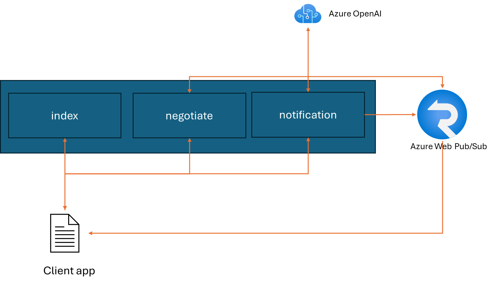

# Azure OpenAI Serverless Chatbot

## Introduction
This is a basic sample, in python, using Azure Functions and Azure Pub/Sub to show interacting with Azure OpenAI models and streaming the response back. At its core, LLMs are predicting the next best word in the sentence and writing that out, taking the ever growing context and predicting the next word. This means the response back from Azure OpenAI can be captured word by word as it predicts the next word. This implementation shows how to combine Azure Functions with Azure Pub/Sub to enable real-time streaming of Azure OpenAI completion based on your question.

## Deployment
You will need to [create an Azure Pub/Sub service](https://learn.microsoft.com/en-us/azure/azure-web-pubsub/howto-develop-create-instance?tabs=CLI&pivots=method-azure-portal).

You will need to [create an Azure OpenAI Service](https://learn.microsoft.com/en-us/azure/ai-services/openai/overview) and deploy the appropriate LLM within that.

You will then need to deploy this code repository to an Azure Function. 

This repository has 3 functions:

1. index - This function simply renders the HTML page which is the client to send questions and receive answers.
2. negotiate - This function allows the client to connect to the Azure Pub/Sub hub and listen for messages
3. notification - This is the main part of the backend where the logic exists to call Azure OpenAI service, passing in a system prompt and the user input. It returns each chunk of the response as it gets it via Azure Pub/Sub  which broadcasts to all listening clients via Websockets.

You will need to add the following app settings to the function service in Azure:

* AZURE_PUBSUB_CONNECTION_STRING
* AZURE_OPENAI_KEY
* AZURE_OPENAI_ENDPOINT

This is what the solution looks like visually and can be built up on as you extend your use case.

